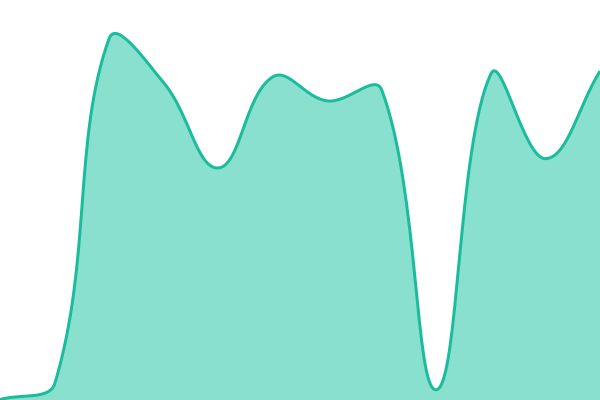
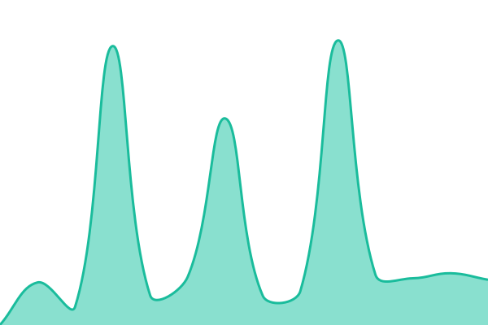

# [📈 Live Status](https://yuliitezarygml.github.io/Upptime): <!--live status--> **🟩 All systems operational**

This repository contains the open-source uptime monitor and status page for [Iulian](https://yuliitezarygml.github.io/Upptime), powered by [Upptime](https://github.com/upptime/upptime).

With [Upptime](https://upptime.js.org), you can get your own unlimited and free uptime monitor and status page, powered entirely by a GitHub repository. We use [Issues](https://github.com/yuliitezarygml/Upptime/issues) as incident reports, [Actions](https://github.com/yuliitezarygml/Upptime/actions) as uptime monitors, and [Pages](https://yuliitezarygml.github.io/Upptime) for the status page.

<!--start: status pages-->
<!-- This summary is generated by Upptime (https://github.com/upptime/upptime) -->
<!-- Do not edit this manually, your changes will be overwritten -->
<!-- prettier-ignore -->
| URL | Status | History | Response Time | Uptime |
| --- | ------ | ------- | ------------- | ------ |
|  [MagnumCinema](https://magnumcinema.com/) | 🟩 Up | [magnum-cinema.yml](https://github.com/yuliitezarygml/Upptime/commits/HEAD/history/magnum-cinema.yml) | 

 754ms
     
 | 

<a href="https://yuliitezarygml.github.io/Upptime/history/magnum-cinema">100.00%</a>
    

|  [MagnumCinema API](https://magnumcinema.com/api/auth/me) | 🟩 Up | [magnum-cinema-api.yml](https://github.com/yuliitezarygml/Upptime/commits/HEAD/history/magnum-cinema-api.yml) | 

 1196ms
     
 | 

<a href="https://yuliitezarygml.github.io/Upptime/history/magnum-cinema-api">94.11%</a>
    

|  [Kino Dev](https://kino.sinkdev.games/) | 🟩 Up | [kino-dev.yml](https://github.com/yuliitezarygml/Upptime/commits/HEAD/history/kino-dev.yml) | 

 1018ms
     
 | 

<a href="https://yuliitezarygml.github.io/Upptime/history/kino-dev">98.69%</a>
    

<!--end: status pages-->

[**Visit our status website →**](https://yuliitezarygml.github.io/Upptime)

## 📄 License

- Powered by: [Upptime](https://github.com/upptime/upptime)
- Code: [MIT](./LICENSE) © [Anand Chowdhary](https://anandchowdhary.com)
- Data in the `./history` directory: [Open Database License](https://opendatacommons.org/licenses/odbl/1-0/)
